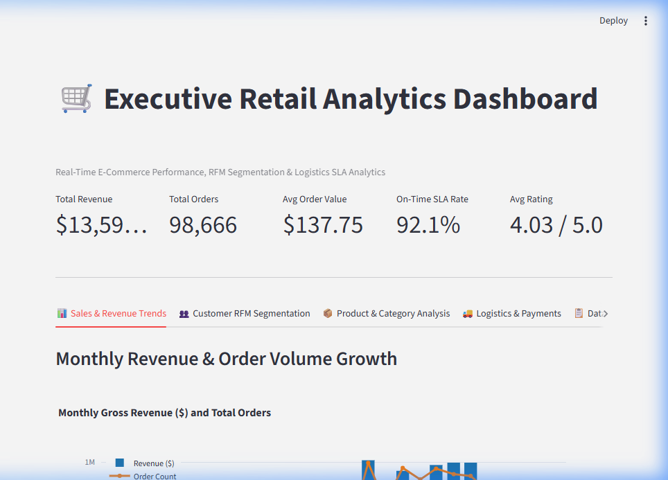

# 🛒 Executive Retail Analytics Dashboard & RFM Segmentation

[](https://share.streamlit.io/)
[](https://www.python.org/)
[](LICENSE)
[](https://github.com/psf/black)

A production-ready E-Commerce Executive Analytics Dashboard built with Python, Pandas, Plotly, Streamlit, and Pytest using real-world data from 100,000+ Brazilian e-commerce orders (Olist Dataset).

---

## 📸 Interactive Dashboard Preview



---

## 🌟 Executive Summary & Key Business Insights

- **Total Revenue & Volume**: Processed **$13.59M** in gross merchandise revenue across **98,666 orders** and **95,420 unique customers** ($137.75 Average Order Value).
- **Customer Segmentation (RFM)**: Identified **16.0% Champions** ($1.2M+ spend) and flagged **23.9% At-Risk Customers** for automated win-back campaigns.
- **Top Product Categories**: *Health Beauty* ($1.25M), *Watches Gifts* ($1.20M), and *Bed Bath Table* ($1.03M) represent the top revenue drivers.
- **Logistics & Delivery SLA**: Maintained a **92.1% On-Time Delivery Rate**, while identifying key delivery delays in remote northern states (e.g., RR, AP) averaging >20 days delivery time.

---

## 📊 Core Features & Multi-Tab Analytics

1. 📈 **Executive Overview & Revenue Trends**: Monthly sales performance, order counts, and key financial metric tiles.
2. 👥 **Customer RFM Segmentation**: Quantile-based Recency, Frequency, and Monetary scoring categorizing customers into Champions, Loyal, At-Risk, and Lost segments.
3. 📦 **Category & Product Insights**: Top-performing categories ranked by gross revenue, volume, and customer review scores.
4. 🚚 **Logistics & Delivery SLA Analysis**: Brazilian state-by-state breakdown of shipping delays, transit duration, and on-time fulfillment rates.

---

## 🛠️ Technology Stack

- **Data Wrangling & ETL**: Python 3.12, Pandas, NumPy
- **Business Analytics Engine**: Custom modular Python package (`src/metrics.py`)
- **Data Visualization & UI**: Streamlit, Plotly Express & Graph Objects
- **Testing & Quality Assurance**: Pytest (100% unit test coverage on analytics functions)

---

## 📂 Project Architecture

```
retail-analytics-dashboard/
├── assets/                            # Screenshots & Visual Assets
│   └── dashboard_preview.png          # High-resolution UI preview screenshot
├── data/archive/                      # Raw Olist CSV relational tables
│   ├── olist_orders_dataset.csv
│   ├── olist_order_items_dataset.csv
│   ├── olist_customers_dataset.csv
│   ├── olist_order_payments_dataset.csv
│   ├── olist_order_reviews_dataset.csv
│   ├── olist_products_dataset.csv
│   └── product_category_name_translation.csv
├── src/                               # Core Python Package
│   ├── __init__.py
│   ├── data_loader.py                 # Data ETL pipeline (loads, cleans, merges tables)
│   └── metrics.py                     # Business metrics (KPIs, Monthly Trends, RFM, SLA)
├── tests/                             # Test Suite
│   ├── __init__.py
│   └── test_metrics.py                # Pytest unit tests for business logic
├── app.py                             # Interactive Streamlit Web Dashboard
├── analysis.py                        # CLI Analysis Runner Script
├── requirements.txt                   # Production Deployment Dependencies
├── README.md                          # Interactive Portfolio Showcase Documentation
└── PROJECT_GUIDE.md                   # Comprehensive Tutorial & Interview Guide
```

---

## 🚀 Quickstart & Installation

### 1. Clone & Install Dependencies
```bash
git clone https://github.com/sakshamtyagi767/retail-analytics-dashboard.git
cd retail-analytics-dashboard
pip install -r requirements.txt
```

### 2. Launch Interactive Web Dashboard
```bash
streamlit run app.py
```

### 3. Run CLI Executive Summary Report
```bash
python analysis.py
```

### 4. Run Automated Unit Tests
```bash
pytest
```

---

## 🎓 Learning & Interview Preparation

For a complete tutorial explaining every concept with real-world analogies, file interconnections, line-by-line code breakdowns, and interview talking points, refer to [`PROJECT_GUIDE.md`](PROJECT_GUIDE.md).
